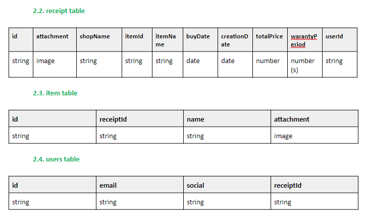

## Receipt saving application

#### Development setup
**Setup**
* `npm install`
* `serverless dynamodb install`
* `serverless offline start`
* `serverless dynamodb migrate` (this imports schema)

**Run service offline**

`serverless offline start`

#### Database tables: 

#### Debugging:
1) to debug using NiM (Node.js V8 --inspector Manager (NiM)) extension:
set env variable with your serverless.js location:
* `setx slsloc "C:\Users\YourUserName\AppData\Roaming\nvm\v10.16.3\node_modules\serverless\bin\serverless"`
* `node --inspect %slsloc% offline start`
2) on IntellijIdea look at screenshots in `./info` folder
